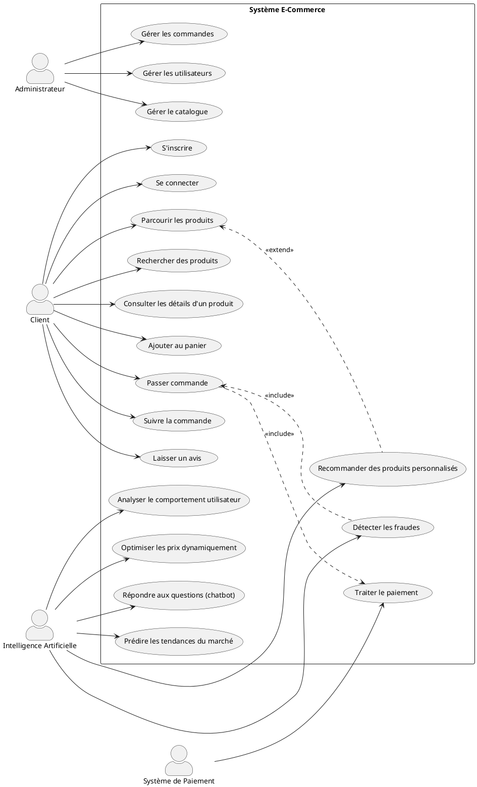
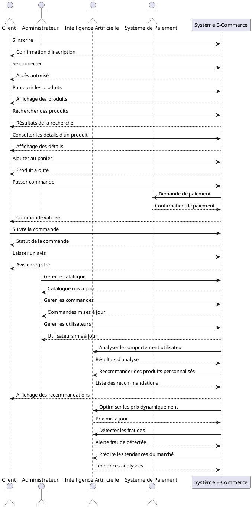

![[Pasted image 20250305130946.png]]

**Le diagramme de séquence UML est une représentation dynamique et détaillée d’un scénario décrit dans un diagramme de cas d'utilisation** :
*  Il montre la **chronologie des échanges** entre les objets du système.
*  Il **détaille l’exécution du scénario**, en spécifiant l’ordre des messages échangés.
        

---

![[Pasted image 20250305130547.png]]

---

## Exemple d'un diagramme de cas d'utilisation  pour un système e-commerce qui intègre l'intelligence artificielle 

Ce diagramme montre:

**Acteurs:**

- Client: l'utilisateur principal du système
- Administrateur: gère le système
- Intelligence Artificielle: fournit des services basés sur l'IA
- Système de Paiement: acteur externe pour les transactions

**Cas d'utilisation pour le Client:**

- S'inscrire et se connecter
- Parcourir et rechercher des produits
- Consulter les détails d'un produit
- Ajouter au panier et passer commande
- Suivre la commande
- Laisser un avis

**Cas d'utilisation pour l'Administrateur:**

- Gérer le catalogue
- Gérer les commandes
- Gérer les utilisateurs

**Cas d'utilisation pour l'Intelligence Artificielle:**

- Recommander des produits personnalisés
- Analyser le comportement utilisateur
- Optimiser les prix dynamiquement
- Répondre aux questions (chatbot)
- Détecter les fraudes
- Prédire les tendances du marché

**Relations:**

- Le paiement est inclus dans le processus de commande
- La recommandation de produits étend la navigation
- La détection de fraude est incluse dans le processus de commande

---

## Le diagramme de séquence correspondant au diagramme de cas d'utilisation. 

Il détaille les interactions entre le **Client**, le **Système de recommandation de livres** et le **Système de recommandation IA**.

